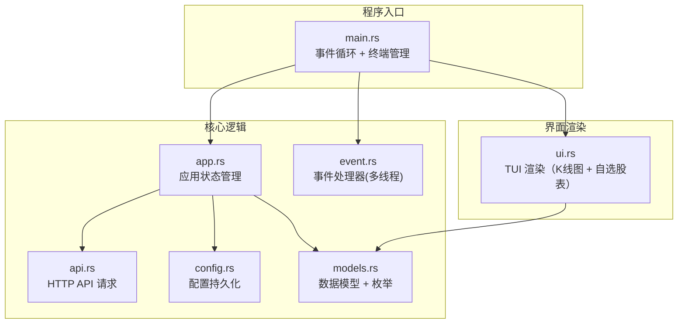
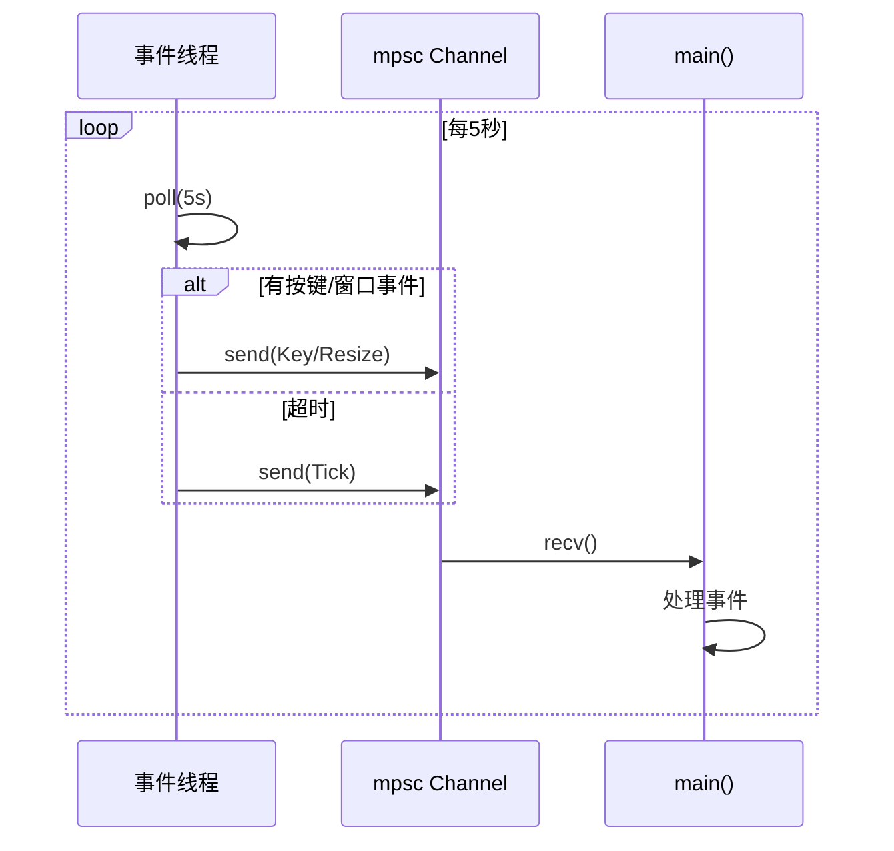

# Stock-TUI 项目学习指南 🦀

本指南将帮助你通过这个**股票行情终端应用**项目，系统性地学习 Rust 编程。

## 项目总览



---

## 文件阅读顺序

> [!TIP]
> 建议按以下顺序阅读源码，每个文件都有明确的 Rust 学习重点。

| 顺序 | 文件 | 核心 Rust 概念 |
|:---:|------|-------------|
| 1️⃣ | [models.rs](file:///home/nixos/projects/test_rust/src/models.rs) | struct, enum, impl, `#[derive]`, trait |
| 2️⃣ | [config.rs](file:///home/nixos/projects/test_rust/src/config.rs) | 序列化, `Option`, 文件 I/O, `Default` trait |
| 3️⃣ | [api.rs](file:///home/nixos/projects/test_rust/src/api.rs) | `Result` 错误处理, 字符串切片 `&str`, HTTP 请求 |
| 4️⃣ | [event.rs](file:///home/nixos/projects/test_rust/src/event.rs) | 多线程 `thread::spawn`, `mpsc` 通道, 闭包 |
| 5️⃣ | [app.rs](file:///home/nixos/projects/test_rust/src/app.rs) | 所有权 `&mut self`, `Vec`, 模式匹配 |
| 6️⃣ | [main.rs](file:///home/nixos/projects/test_rust/src/main.rs) | 模块系统 `mod`, `?` 操作符, 主事件循环 |
| 7️⃣ | [ui.rs](file:///home/nixos/projects/test_rust/src/ui.rs) | 闭包捕获, `move`, 迭代器链式调用 |

---

## 1️⃣ models.rs — 数据模型基础

### 学到的 Rust 概念

#### **Struct（结构体）** — 定义数据的形状

```rust
// struct 类似其他语言的 class，但没有继承
#[derive(Debug, Clone)]         // 自动派生 trait
pub struct StockQuote {
    pub name: String,           // pub = 公开字段
    pub current: f64,           // f64 = 64位浮点数
    pub volume: f64,
    // ...
}
```

> [!NOTE]
> **`#[derive(...)]`** 是 Rust 的过程宏。`Debug` 让你能用 `{:?}` 打印，`Clone` 让你能复制整个结构体。`Deserialize` 让 serde 能自动将 JSON 解析成 struct。

#### **impl 方法** — 为结构体添加行为

```rust
impl StockQuote {
    // &self = 不可变借用，只读访问
    pub fn change(&self) -> f64 {
        self.current - self.pre_close  // 最后一行无分号 = 返回值
    }

    // 返回 String（堆分配）
    pub fn volume_display(&self) -> String {
        if lots >= 10000.0 {
            format!("{:.1}万手", lots / 10000.0)  // format! 返回 String
        } else {
            format!("{:.0}手", lots)
        }
    }
}
```

> [!IMPORTANT]
> **Rust 没有异常**，函数末尾不写 `;` 的表达式就是返回值。`format!()` 和 `println!()` 末尾的 `!` 表示这是**宏**而不是函数。

#### **Enum（枚举）** — Rust 最强大的特性之一

```rust
#[derive(Debug, Clone, Copy, PartialEq, Eq)]
pub enum TimeFrame {
    Min5, Min15, Min30, Min60,
    Daily, Weekly, Monthly,
}

impl TimeFrame {
    // match 必须穷尽所有变体，编译器会检查
    pub fn scale(&self) -> u32 {
        match self {
            TimeFrame::Min5 => 5,
            TimeFrame::Daily => 240,
            // ... 省略其他
        }
    }
    
    // 返回 &'static str（静态生命周期的字符串引用）
    pub fn label(&self) -> &'static str {
        match self {
            TimeFrame::Daily => "日K",
            // ...
        }
    }
}
```

> [!TIP]
> `&'static str` 是编译时就确定的字符串切片，放在二进制文件里，程序运行期间一直有效。而 `String` 是堆上分配的、可变的。

#### **单元测试** — `#[cfg(test)]`

```rust
#[cfg(test)]               // 只在测试时编译此模块
mod tests {
    use super::*;           // 导入父模块的所有内容

    #[test]                 // 标记测试函数
    fn test_calculate_ma() {
        let data: Vec<KLineData> = prices
            .iter()                         // 创建迭代器
            .map(|&p| KLineData { ... })    // 闭包转换每个元素
            .collect();                     // 收集为 Vec
        
        assert_eq!(ma3[2], Some(20.0));     // 断言相等
    }
}
```

---

## 2️⃣ config.rs — 配置与序列化

### 学到的 Rust 概念

#### **Serde 序列化** — `Serialize` + `Deserialize`

```rust
#[derive(Debug, Serialize, Deserialize, Clone)]
pub struct Config {
    pub watchlist: Vec<String>,     // Vec<T> = 动态数组
}
```

只需要加 `#[derive(Serialize, Deserialize)]`，serde 就能自动将 struct 转成 JSON 并反向解析。

#### **Default trait** — 提供默认值

```rust
impl Default for Config {
    fn default() -> Self {
        Self {
            watchlist: vec![
                "sh600519".to_string(),  // &str → String
            ],
        }
    }
}
```

#### **`Option<T>`** — Rust 没有 null，用 Option 代替

```rust
pub fn load() -> Self {
    if let Some(path) = Self::get_config_path() {  // 解包 Option
        if path.exists() {
            if let Ok(content) = fs::read_to_string(&path) {  // 解包 Result
                if let Ok(config) = serde_json::from_str(&content) {
                    return config;      // 提前返回
                }
            }
        }
    }
    Self::default()  // 兜底默认值
}
```

> [!NOTE]
> `if let` 是 `match` 的语法糖，当你只关心一个分支时，用 `if let` 代码更简洁。

---

## 3️⃣ api.rs — HTTP 请求与错误处理

### 学到的 Rust 概念

#### **`Result<T, E>`** — Rust 的错误处理核心

```rust
// anyhow::Result<T> = Result<T, anyhow::Error>，简化错误类型
pub fn fetch_realtime_quote(symbol: &str) -> Result<StockQuote> {
    let resp = client
        .get(&url)
        .send()
        .context("请求实时行情失败")?;    // ? 操作符：出错就提前返回
    
    let bytes = resp.bytes().context("读取响应数据失败")?;
    
    parse_realtime_quote(symbol, &text)   // 最后一行 = 返回值
}
```

> [!IMPORTANT]
> **`?` 是 Rust 最重要的错误处理语法**。它相当于 "如果出错，立刻带着错误返回；如果成功，取出值继续"。`.context()` 给错误添加上下文信息。

#### **字符串切片 `&str` vs `String`**

```rust
fn parse_realtime_quote(symbol: &str, text: &str) -> Result<StockQuote> {
    // &str = 借用的字符串切片，不拥有数据
    let start = text.find('"').context("...")? + 1;
    let data = &text[start..end];              // 切片语法
    let fields: Vec<&str> = data.split(',').collect();  // 分割成切片数组
    
    // .to_string() 将 &str 复制为独立的 String
    Ok(StockQuote {
        name: fields[0].to_string(),
        open: fields[1].parse().unwrap_or(0.0),  // 字符串解析为数字
    })
}
```

> [!TIP]
> 记住口诀：**`&str` 是借用（引用），`String` 是拥有（所有权）**。函数参数尽量用 `&str`（更灵活），struct 字段用 `String`（拥有数据）。

#### **`anyhow::bail!`** — 快速返回错误

```rust
if fields.len() < 32 {
    anyhow::bail!("A股行情数据字段不足: 期望32+，实际{}", fields.len());
    // 等价于: return Err(anyhow::anyhow!("..."));
}
```

---

## 4️⃣ event.rs — 多线程与消息通道

### 学到的 Rust 概念

#### **`mpsc` 通道** — 多线程通信

```rust
pub fn new(tick_rate: Duration) -> Self {
    let (tx, rx) = mpsc::channel();  // 创建通道: tx=发送端, rx=接收端
    let event_tx = tx.clone();       // clone 一个发送端给子线程

    thread::spawn(move || {          // move: 将 event_tx 的所有权移入闭包
        loop {
            if event::poll(tick_rate).unwrap_or(false) {
                // 有事件，发送给主线程
                if event_tx.send(app_event).is_err() {
                    break;  // 接收端关闭，退出线程
                }
            } else {
                // 超时，发送 Tick
                event_tx.send(AppEvent::Tick);
            }
        }
    });

    Self { rx, _tx: tx }  // _tx 前缀 _ = 告诉编译器此字段不直接使用
}
```



> [!IMPORTANT]
> **`move` 关键字**十分关键。子线程的闭包需要拥有 `event_tx` 的所有权，因为子线程的生命周期可能超过创建它的函数。没有 `move`，编译器会拒绝编译。

---

## 5️⃣ app.rs — 应用状态与所有权

### 学到的 Rust 概念

#### **`&mut self`** — 可变借用

```rust
impl App {
    // &mut self = 可变借用，可以修改 self 的字段
    pub fn refresh_quotes(&mut self) {
        self.quotes = results.into_iter()
            .map(|r| match r {
                Ok(q) => Some(q),
                Err(e) => {
                    self.status_message = format!("获取行情失败: {}", e);
                    None
                }
            })
            .collect();
    }

    // &self = 不可变借用，只读
    pub fn current_quote(&self) -> Option<&StockQuote> {
        self.quotes.get(self.active_index).and_then(|q| q.as_ref())
    }
}
```

> [!NOTE]
> **Rust 借用规则**：同一时刻，要么有一个 `&mut`（可变引用），要么有多个 `&`（不可变引用），不能同时存在。这是 Rust 内存安全的核心。

#### **`Option` 的链式操作**

```rust
// .get() 返回 Option<&T>
// .and_then() 在 Some 时继续操作
// .as_ref() 将 &Option<T> 转为 Option<&T>
pub fn current_quote(&self) -> Option<&StockQuote> {
    self.quotes.get(self.active_index)   // Option<&Option<StockQuote>>
        .and_then(|q| q.as_ref())        // Option<&StockQuote>
}
```

#### **模式匹配与状态机**

```rust
pub fn select_prev(&mut self) {
    let i = match self.watchlist_state.selected() {
        Some(i) => {
            if i == 0 { self.watchlist.len() - 1 }  // 循环到末尾
            else { i - 1 }
        }
        None => 0,
    };
    self.watchlist_state.select(Some(i));
}
```

---

## 6️⃣ main.rs — 程序入口与模块系统

### 学到的 Rust 概念

#### **模块声明** — `mod`

```rust
mod api;        // 声明模块，编译器会查找 api.rs
mod app;
mod models;
mod ui;
// 现在可以通过 crate::api::xxx 访问
```

#### **`?` 操作符贯穿全程**

```rust
fn main() -> Result<()> {           // main 可以返回 Result
    enable_raw_mode()?;             // 失败就退出
    execute!(stdout, EnterAlternateScreen)?;
    let mut terminal = Terminal::new(backend)?;
    
    loop {
        terminal.draw(|f| ui::draw(f, &mut app))?;
        // ...
    }
    
    disable_raw_mode()?;            // 清理
    Ok(())                          // 成功返回
}
```

#### **事件循环 = match 嵌套 match**

```rust
match events.next()? {
    AppEvent::Key(key) => {
        match app.input_mode {
            InputMode::Normal => match key.code {
                KeyCode::Char('q') => app.should_quit = true,
                KeyCode::Char('a') => app.start_add_stock(),
                // ...
            },
            InputMode::AddStock => match key.code {
                KeyCode::Enter => app.confirm_add_stock(),
                KeyCode::Char(c) => app.input_buffer.push(c),
                // ...
            },
        }
    }
    AppEvent::Tick => app.refresh_quotes(),
}
```

---

## 7️⃣ ui.rs — 闭包与渲染

### 学到的 Rust 概念

#### **闭包捕获与 `move`**

```rust
// Canvas::paint 需要一个 move 闭包
let ma5_clone = ma5.clone();   // 先 clone，因为 move 会转移所有权

let canvas = Canvas::default()
    .paint(move |ctx| {        // move: 将所有被引用的变量移入闭包
        // 在闭包内使用 ma5_clone（已被 move 进来）
        // 不能再使用外部的 ma5_clone
    });
```

> [!WARNING]
> 这段代码 clone 了均线数据是因为闭包需要 `move` 所有权，但闭包外部也需要这些数据（用于游标信息展示）。这是 Rust 所有权系统在实践中常见的权衡。

#### **迭代器链式调用**

```rust
let rows: Vec<Row> = app.watchlist
    .iter()                     // 创建迭代器
    .enumerate()                // 附带索引 (i, item)
    .map(|(i, symbol)| {        // 转换每个元素
        // ... 构建 Row
    })
    .collect();                 // 收集为 Vec<Row>
```

---

## 关键的 Cargo.toml 依赖说明

```toml
[dependencies]
ratatui = "0.29"          # TUI 框架（终端界面）
crossterm = "0.28"        # 跨平台终端控制（键盘/鼠标/颜色）
reqwest = { version = "0.12", features = ["blocking", "rustls-tls"] }  # HTTP 客户端
serde = { version = "1", features = ["derive"] }  # 序列化框架
serde_json = "1"          # JSON 解析
encoding_rs = "0.8"       # 字符编码转换（GBK → UTF-8）
anyhow = "1"              # 简化错误处理
chrono = "0.4"            # 日期时间
directories = "6.0.0"     # 跨平台配置目录
```

> [!NOTE]
> `features = ["derive"]` 启用了 `#[derive(Serialize, Deserialize)]`。`features = ["blocking"]` 启用了同步 HTTP 请求。Rust 的 crate 可以选择性编译功能，减少最终二进制体积。

---

## 练习建议 🎯

按难度递进，建议尝试以下改进：

| 难度 | 练习方向 | 涉及的 Rust 知识 |
|:---:|---------|---------------|
| ⭐ | 给 `StockQuote` 添加换手率字段 | struct 设计, `impl` |
| ⭐⭐ | 添加按涨跌幅排序功能 | `Vec::sort_by`, 闭包, `PartialOrd` |
| ⭐⭐ | 给配置文件加上默认周期设置 | Serde, `Default` trait |
| ⭐⭐⭐ | 把 `reqwest::blocking` 改为异步 `async/await` | `tokio`, `async`, `Future` |
| ⭐⭐⭐ | 添加搜索股票功能（模糊匹配） | `String` 方法, 迭代器 `filter` |
| ⭐⭐⭐⭐ | 加入 SQLite 存储历史数据 | `rusqlite`, 生命周期, 错误类型转换 |

---

## 如何运行 & 测试

```bash
# 编译并运行
cargo run

# 运行单元测试
cargo test

# 查看编译器详细错误提示（学习利器！）
cargo check

# 代码格式化
cargo fmt

# 代码质量检查（发现潜在问题）
cargo clippy
```

> [!TIP]
> `cargo clippy` 是学习 Rust 地道写法的好工具，它会建议更 idiomatic 的写法。`cargo check` 比 `cargo build` 快得多，适合频繁检查。
